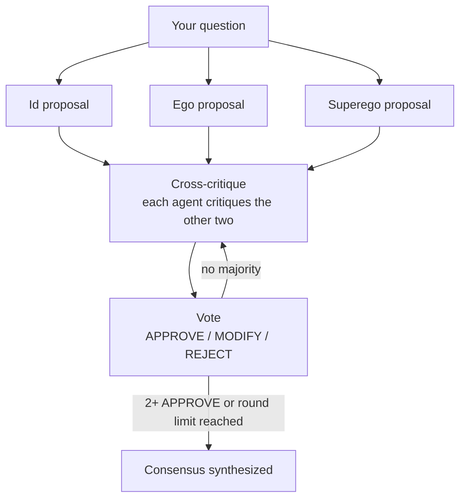

# T.R.I.A.D. — Tripartite Rational Inquiry & Automated Decisioning

*Synthetic network for objective deliberation.*

T.R.I.A.D. is a multi-agent decision engine. Instead of asking one language model for an answer, it puts your question to three AI agents with deliberately different priorities, lets them criticise each other, has them vote, and then synthesizes a final consensus. Every step of the debate is shown in the interface, so you can see *how* the answer was reached, not only *what* it is.

The three agents are modelled on Freud's structural model of the mind:

| Agent | Role | Focus | Default local model |
|---|---|---|---|
| **Id** | Instinct / pragmatist | Practical execution, speed, cost, human desires, compromise | `qwen2.5:1.5b` |
| **Ego** | Rationalist | Evidence, logic, rigor, feasibility | `deepseek-r1:1.5b` (reasoning model) |
| **Superego** | Conscience | Safety, ethics, risk, long-term wellbeing | `llama3.2:1b` |

The concept is inspired by the MAGI supercomputer from *Neon Genesis Evangelion*, where three personalities must reach a majority before a decision is made.

---

## How it works



1. **Proposals.** All three agents answer the question in parallel, each from its own perspective.
2. **Cross-critique.** Each agent critiques the other two. From round 2 on, they also see the previous round's critiques.
3. **Vote.** Each agent votes `APPROVE`, `MODIFY` or `REJECT`.
4. **Routing.** With two or more approvals, or once the round limit is reached (2 by default), the debate ends. Otherwise another critique round starts.
5. **Consensus.** A final answer is synthesized from the proposals, critiques and votes.

The interface updates live after every step, and the **Debate log** shows each round as cards: who critiqued whom, what they said, and how they voted.

---

## Quick start

### Requirements

- Python 3.10 or newer
- **Local mode:** [Ollama](https://ollama.com) (a recent version with "thinking" support, 0.9 or newer)
- **Online mode:** an OpenAI API key (see [Limitations](#limitations) about costs)

### Installation

```bash
git clone https://github.com/TheJohn01/TRIAD-Decision-Engine.git
cd <your-repo>

python -m venv .venv
# Windows: .venv\Scripts\activate
# macOS / Linux:
source .venv/bin/activate

pip install -r requirements.txt
```

For local mode, pull the three models once:

```bash
ollama pull qwen2.5:1.5b
ollama pull deepseek-r1:1.5b
ollama pull llama3.2:1b
```

### Run

```bash
python app.py
```

The interface opens in your browser. Choose **Local (Ollama)** or **Online (Cloud APIs)**, initialize the engine, type a question and press **Execute T.R.I.A.D. debate**.

---

## Project structure

```
├── app.py            # Agents, LangGraph debate pipeline and Gradio interface
├── style.css         # Dark theme and debate log styling
├── requirements.txt  # Python dependencies
└── README.md
```

## Configuration

All settings live at the top of `app.py`.

| Setting | What it does |
|---|---|
| `AGENTS` | Name, prompt, model, temperature and token limit of each agent. Changing an agent is a one-place edit. |
| `MAX_ROUNDS` | Maximum number of critique-and-vote rounds (default `2`). |
| `REQUEST_TIMEOUT` | Seconds before a single model call gives up (default `180`). |
| `get_model()` | Which model is used in Online mode (default `gpt-4o-mini`). |

You can swap in larger local models (for example `qwen2.5:7b` or `llama3.1:8b`) by changing `local_model`, provided your machine has the memory for them. If you use another reasoning model for Ego, keep `"thinks": True` on it.

---

## Limitations

- **Small local models.** The default models have 1 to 1.5 billion parameters so they run on ordinary hardware. Their reasoning is shallow, they can contradict themselves, and they sometimes ignore instructions such as "answer in one word". Treat the output as a demonstration of the debate process, not as expert advice.
- **Not a decision authority.** Majority agreement between three models is not evidence of correctness. Models can agree on something false. Do not rely on T.R.I.A.D. for medical, legal, financial or safety-critical decisions.
- **Speed.** A full debate makes up to 16 model calls. On a CPU-only machine a local run can take several minutes. Online mode is much faster.
- **Proposals are never revised.** Agents critique the original proposals in every round but do not rewrite them, so extra rounds add limited value.
- **Consensus bias.** The final consensus is written by the Ego model, so it may lean towards Ego's rational perspective.
- **Simple vote parsing.** Votes are read by finding the first `APPROVE`, `MODIFY` or `REJECT` in the reply. An unclear reply counts as `MODIFY`.
- **Truncated context.** Proposals and critiques are cut to 1,200 characters each when passed to the next step, to fit the small models' context window.
- **Online mode is OpenAI only, and paid.** The cloud option is hard-wired to OpenAI, which bills per use. Free OpenAI-compatible providers exist, but adding them requires a small code change (see below).
- **No saved history.** Debates are not stored. Closing the page loses them.
- **API key handling.** The key is kept only in memory for your browser session and is never written to disk. Even so, don't run the app with a public share link while your own key is entered.

## Possibilities and roadmap

- **Revision step.** Let each agent revise its proposal after the critiques, which would make a third round worthwhile.
- **Provider choice.** A dropdown for Groq, Google Gemini, OpenRouter or Mistral, which offer free tiers through OpenAI-compatible APIs.
- **Neutral synthesizer.** Use a separate, larger model to write the consensus so no single agent dominates it.
- **Structured votes.** Ask for JSON votes with a short justification, instead of parsing one word.
- **Export.** Save a debate as Markdown or JSON for later reference.
- **More or different agents.** The `AGENTS` dictionary makes it easy to try other perspectives, such as a domain expert or a devil's advocate.
- **Hosting.** Deploy on [Hugging Face Spaces](https://huggingface.co/spaces), which runs Gradio apps for free (Online mode only, as Spaces cannot run Ollama on the free tier).

---

## Troubleshooting

| Problem | Solution |
|---|---|
| "Debate stopped … Is Ollama running?" | Start Ollama and check that all three models are pulled with `ollama list`. |
| Ego's proposal or the consensus is empty | Update Ollama and `langchain-ollama` (`pip install -U langchain-ollama`). Older versions handle reasoning models differently. |
| A run is very slow | Normal on CPU. Use Online mode, smaller prompts, or set `MAX_ROUNDS = 1`. |
| Theme or styling not applied | Make sure you are on Gradio 6 and `style.css` is in the same folder as `app.py`. |

## Built with

[LangGraph](https://github.com/langchain-ai/langgraph) · [LangChain](https://github.com/langchain-ai/langchain) · [Gradio](https://www.gradio.app) · [Ollama](https://ollama.com)