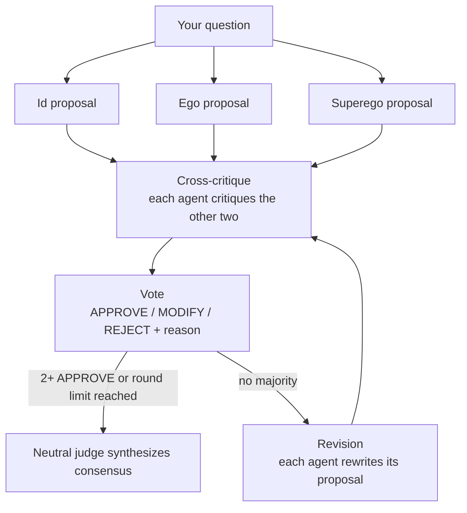

# T.R.I.A.D. — Tripartite Rational Inquiry & Automated Decisioning

*Synthetic network for objective deliberation.*

T.R.I.A.D. is a multi-agent decision engine. Instead of asking one language model for an answer, it puts your question to three AI agents with deliberately different priorities, lets them criticise each other, has them vote and revise, and then a neutral judge synthesizes a final consensus. Every step of the debate is shown in the interface, so you can see *how* the answer was reached, not only *what* it is.

The three agents are modelled on Freud's structural model of the mind:

| Agent | Role | Focus | Default local model |
|---|---|---|---|
| **Id** | Instinct / pragmatist | Practical execution, speed, cost, human desires, compromise | `qwen2.5:1.5b` |
| **Ego** | Rationalist | Evidence, logic, rigor, feasibility | `deepseek-r1:1.5b` (reasoning model) |
| **Superego** | Conscience | Safety, ethics, risk, long-term wellbeing | `llama3.2:1b` |

The concept is inspired by the MAGI supercomputer from *Neon Genesis Evangelion*, where three personalities must reach a majority before a decision is made.

---

## How it works



1. **Proposals.** All three agents answer the question in parallel, each from its own perspective.
2. **Cross-critique.** Each agent critiques the other two. From round 2 on, they critique the revised proposals and also see the previous round's critiques.
3. **Vote.** Each agent votes `APPROVE`, `MODIFY` or `REJECT` and gives a one-sentence reason.
4. **Routing.** With two or more approvals, or once the round limit is reached (2 by default), the debate ends.
5. **Revision.** Without a majority, each agent rewrites its own proposal using the critiques it received, and a new critique round starts.
6. **Consensus.** A separate judge model, which did not take part in the debate, synthesizes the final answer from the proposals, critiques and votes.

The interface updates live after every step. The **Debate log** shows each round as cards: who critiqued whom, what they said, how they voted and why. When the debate ends, you can download it as a JSON file.

---

## Quick start

### Requirements

- Python 3.10 or newer
- **Local mode:** [Ollama](https://ollama.com) (a recent version with "thinking" support, 0.9 or newer)
- **Online mode:** an API key for OpenAI or another OpenAI-compatible provider, such as Groq (see [Configuration](#configuration))

### Installation

```bash
git clone https://github.com/TheJohn01/TRIAD-Decision-Engine.git
cd TRIAD-Decision-Engine

python -m venv .venv
# Windows: .venv\Scripts\activate
# macOS / Linux:
source .venv/bin/activate

pip install -r requirements.txt
```

For local mode, pull the four models once (three debaters and the judge):

```bash
ollama pull qwen2.5:1.5b
ollama pull deepseek-r1:1.5b
ollama pull llama3.2:1b
ollama pull llama3.2:3b
```

### Run

```bash
python app.py
```

The interface opens in your browser. Choose **Local (Ollama)** or **Online (Cloud APIs)**, initialize the engine, type a question and press **Execute T.R.I.A.D. debate**.

### Test

```bash
python test_app.py
```

The tests swap the AI models for fake ones, so they run in about a second without Ollama or an API key. Run them after every change.

---

## Project structure

```
├── app.py            # Agents, LangGraph debate pipeline and Gradio interface
├── style.css         # Dark theme and debate log styling
├── test_app.py       # Quick checks with fake models (no Ollama needed)
├── requirements.txt  # Python dependencies
└── README.md
```

## Configuration

All settings live at the top of `app.py`.

| Setting | What it does |
|---|---|
| `AGENTS` | Name, prompt, model, temperature and token limit of each agent. Changing an agent is a one-place edit. |
| `MAX_ROUNDS` | Maximum number of critique-and-vote rounds (default `2`). |
| `REQUEST_TIMEOUT` | Seconds before a single model call gives up (default `180`). |
| `JUDGE` | Model, prompt and token limit of the neutral judge that writes the consensus (default local model `llama3.2:3b`). |
| `ONLINE_BASE_URL` | Address of the online provider. `None` means OpenAI. |
| `ONLINE_MODEL` | Which model is used in Online mode (default `gpt-4o-mini`). |

You can swap in larger local models (for example `qwen2.5:7b` or `llama3.1:8b`) by changing `local_model`, provided your machine has the memory for them. If you use another reasoning model for Ego, keep `"thinks": True` on it. On a machine with little memory, you can set the judge's `local_model` to one of the three debater models instead, so you only need three models.

To use a free provider instead of OpenAI, change two lines. For example, for Groq:

```python
ONLINE_BASE_URL = "https://api.groq.com/openai/v1"
ONLINE_MODEL = "llama-3.1-8b-instant"
```

Then enter your Groq key on the start screen. Other OpenAI-compatible providers (OpenRouter, Google Gemini, Mistral) work the same way with their own address and model name.

---

## Limitations

- **Small local models.** The default models have 1 to 1.5 billion parameters so they run on ordinary hardware. Their reasoning is shallow, they can contradict themselves, and they sometimes ignore instructions such as "answer in one word". Treat the output as a demonstration of the debate process, not as expert advice.
- **Not a decision authority.** Majority agreement between three models is not evidence of correctness. Models can agree on something false. Do not rely on T.R.I.A.D. for medical, legal, financial or safety-critical decisions.
- **Speed.** A full two-round debate makes 19 model calls (3 proposals, 6 per round, 3 revisions and 1 consensus). On a CPU-only machine a local run can take several minutes. Online mode is much faster.
- **Judge is still a small model.** The neutral judge (`llama3.2:3b`) avoids favouring one debater, but it is only slightly larger than they are, so its summaries can still be shallow.
- **Vote parsing.** Agents are asked to reply with `VOTE: ...` and `REASON: ...`. If a model ignores this format, the first `APPROVE`, `MODIFY` or `REJECT` in the reply is used, and an unclear reply counts as `MODIFY`.
- **Truncated context.** Proposals and critiques are cut to 1,200 characters each when passed to the next step, to fit the small models' context window.
- **One online provider at a time.** The provider is set in `app.py`, not chosen on the start screen. OpenAI bills per use; free providers usually have rate limits.
- **History is a download, not a database.** Each finished debate can be downloaded as JSON, but nothing is kept on the server. Closing the page without downloading loses it.
- **API key handling.** The key is kept only in memory for your browser session. It is never written to disk and is left out of the downloaded JSON. Even so, don't run the app with a public share link while your own key is entered.

## Possibilities and roadmap

- **Provider choice on the start screen.** A dropdown for Groq, Google Gemini, OpenRouter or Mistral, instead of editing `app.py`.
- **More or different agents.** The `AGENTS` dictionary makes it easy to try other perspectives, such as a domain expert or a devil's advocate.
- **Hosting.** Deploy on [Hugging Face Spaces](https://huggingface.co/spaces), which runs Gradio apps for free (Online mode only, as Spaces cannot run Ollama on the free tier).

---

## Troubleshooting

| Problem | Solution |
|---|---|
| "Debate stopped … Is Ollama running?" | Start Ollama and check that all four models are pulled with `ollama list`. |
| The debate stops right at the end | The judge model is probably missing. Run `ollama pull llama3.2:3b`, or set the judge's `local_model` to a model you already have. |
| Ego's proposal is empty | Update Ollama and `langchain-ollama` (`pip install -U langchain-ollama`). Older versions handle reasoning models differently. |
| A run is very slow | Normal on CPU. Use Online mode, smaller prompts, or set `MAX_ROUNDS = 1`. |
| Theme or styling not applied | Make sure you are on Gradio 6 and `style.css` is in the same folder as `app.py`. |

## Development

This project was developed with AI assistance (Claude, by Anthropic). The AI wrote most of
the code. I defined the goals and requirements, chose the direction at each step, ran and 
tested the code on my own machine, reported problems and decided which results to keep.

## Built with

[LangGraph](https://github.com/langchain-ai/langgraph) · [LangChain](https://github.com/langchain-ai/langchain) · [Gradio](https://www.gradio.app) · [Ollama](https://ollama.com)

## License

Released under the MIT License.
